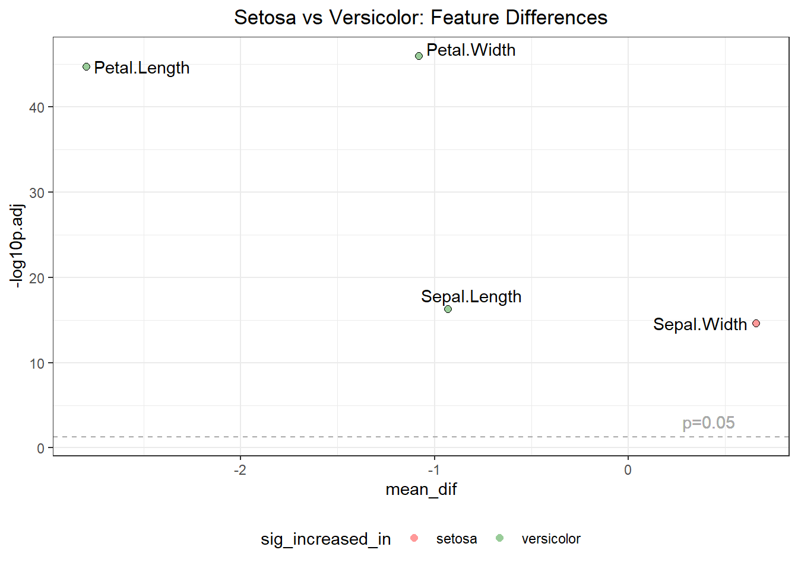

# Statistical Comparisons with comp_means

**[GitHub Repository](https://github.com/afpybus/Pmisc)**

## Introduction

The
[`comp_means()`](https://afpybus.github.io/Pmisc/reference/comp_means.md)
function in Pmisc provides a streamlined way to perform **pairwise
statistical comparisons** across multiple features **between two
groups**. It automatically handles:

- Statistical tests for two-group comparisons (t-test, Wilcoxon)
- P-value adjustment for multiple testing
- Calculation of fold changes and mean differences
- Sample size validation

**Important:** This function is designed for comparing exactly **two
groups**. For multi-group comparisons, filter your data to two groups at
a time.

It wraps the powerful **`ggpubr`** package functions to provide a more
opinionated, high-throughput workflow.

This vignette demonstrates the function using a **simulated gene
expression dataset** with 50 genes across two experimental groups
(Control vs Treatment), showcasing the function’s capability for
high-throughput multivariate analysis.

## Load Package

``` r

library(Pmisc)
library(dplyr)
library(ggplot2)
library(tibble)
```

## Simulating Gene Expression Data

To demonstrate the function’s capability with high-dimensional data,
let’s simulate a gene expression dataset with 50 genes across two
experimental groups: “Control” and “Treatment”.

``` r

set.seed(123) # For reproducibility

# 1. Create sample metadata
n_samples <- 20 # 10 per group
metadata <- data.frame(
    sample_id = paste0("S", 1:n_samples),
    group = rep(c("Control", "Treatment"), each = n_samples / 2),
    stringsAsFactors = FALSE
)

# 2. Simulate gene expression matrix (50 genes)
# Most genes will be unchanged, some will be differentially expressed
genes <- paste0("Gene_", 1:50)
expression_data <- matrix(rnorm(n_samples * 50, mean = 10, sd = 2), nrow = n_samples)
colnames(expression_data) <- genes

# Convert to data frame and add group info
df_genes <- cbind(metadata, as.data.frame(expression_data))

# 3. Introduce signal (Differential Expression)
# Upregulate 5 genes in Treatment
up_genes <- c("Gene_1", "Gene_2", "Gene_3", "Gene_4", "Gene_5")
df_genes[df_genes$group == "Treatment", up_genes] <- df_genes[df_genes$group == "Treatment", up_genes] + 3

# Downregulate 5 genes in Treatment
down_genes <- c("Gene_6", "Gene_7", "Gene_8", "Gene_9", "Gene_10")
df_genes[df_genes$group == "Treatment", down_genes] <- df_genes[df_genes$group == "Treatment", down_genes] - 3

# View structure
head(df_genes[, c("sample_id", "group", "Gene_1", "Gene_6", "Gene_50")])
#>   sample_id   group    Gene_1    Gene_6   Gene_50
#> 1        S1 Control  8.879049  8.579187 14.610124
#> 2        S2 Control  9.539645 10.513767  7.750793
#> 3        S3 Control 13.117417  9.506616  9.389061
#> 4        S4 Control 10.141017  9.304915  8.966481
#> 5        S5 Control 10.258575  8.096763 13.024791
#> 6        S6 Control 13.430130  9.909945  8.461030
```

## Running the Comparison

Now we run
[`comp_means()`](https://afpybus.github.io/Pmisc/reference/comp_means.md)
on all 50 genes simultaneously.

``` r

# Define all gene columns as features
features <- genes

# Run comparison
results <- comp_means(
    df = df_genes,
    feature_column_names = features,
    group_column_name = "group",
    compare_means_method = "t.test",
    p.adjust_method = "fdr"
)

# View top significant results
results %>%
    filter(p.adj < 0.05) %>%
    arrange(p.adj) %>%
    select(feature, group1, group2, mean_dif, p.adj, p.adj.signif) %>%
    head(10) %>%
    knitr::kable(digits = 4)
```

| feature | group1  | group2    | mean_dif |  p.adj | p.adj.signif |
|:--------|:--------|:----------|---------:|-------:|:-------------|
| Gene_2  | Control | Treatment |  -4.4932 | 0.0005 | \*\*\*       |
| Gene_6  | Control | Treatment |   2.8541 | 0.0080 | \*\*         |
| Gene_10 | Control | Treatment |   3.5345 | 0.0087 | \*\*         |
| Gene_3  | Control | Treatment |  -3.4608 | 0.0099 | \*\*         |
| Gene_5  | Control | Treatment |  -3.2480 | 0.0099 | \*\*         |
| Gene_1  | Control | Treatment |  -3.2680 | 0.0149 | \*           |
| Gene_9  | Control | Treatment |   3.4942 | 0.0186 | \*           |

## Volcano Plot Visualization

With 50 variables, the volcano plot becomes a powerful tool to visualize
the overall landscape of differential expression.

``` r

# Define colors: Control (blue), Treatment (red), ns (gray)
# Note: "Control" is the reference, so "Treatment" is the comparison group
sig_colors <- data.frame(
    breaks = c("Control", "Treatment", "ns"),
    values = c("dodgerblue", "firebrick", "grey80"),
    stringsAsFactors = FALSE
)

# Create volcano plot
volcano_cm(
    comp_means_output = results,
    x = "mean_dif",
    max_overlaps = 20
) +
    scm(sig_colors) +
    ggtitle("Differential Expression: Treatment vs Control")
```



The plot clearly shows our simulated signal: - **Red points (Right)**:
Genes upregulated in Treatment (Gene_1 to Gene_5) - **Blue points
(Left)**: Genes higher in Control (meaning downregulated in Treatment)
(Gene_6 to Gene_10) - **Gray points (Bottom/Middle)**: Unchanged
background genes

## Visualizing Top Hits

We can verify our top hits using boxplots.

``` r

# Visualize top upregulated gene
p1 <- DEF_boxplot(
    data = df_genes,
    DE = results,
    feature = "Gene_1", # Known upregulated
    grouping = "group"
) + ggtitle("Gene_1 (Upregulated)")

# Visualize top downregulated gene
p2 <- DEF_boxplot(
    data = df_genes,
    DE = results,
    feature = "Gene_6", # Known downregulated
    grouping = "group"
) + ggtitle("Gene_6 (Downregulated)")

# Arrange side by side
ggpubr::ggarrange(p1, p2, ncol = 2)
```


## Non-Parametric Tests (Wilcoxon)

We can also perform the same broad comparison using the Wilcoxon test.

``` r

# Run Wilcoxon test on all genes
results_wilcox <- comp_means(
    df = df_genes,
    feature_column_names = features,
    group_column_name = "group",
    compare_means_method = "wilcox.test",
    p.adjust_method = "fdr"
)

# Compare p-values for a specific gene (e.g., Gene_1)
comparison <- data.frame(
    feature = "Gene_1",
    t_test_p = format.pval(results$p.adj[results$feature == "Gene_1"], digits = 3, eps = 0.001),
    wilcox_p = format.pval(results_wilcox$p.adj[results_wilcox$feature == "Gene_1"], digits = 3, eps = 0.001)
)

knitr::kable(comparison)
```

| feature | t_test_p | wilcox_p |
|:--------|:---------|:---------|
| Gene_1  | 0.0149   | 0.0328   |

## Summary

The
[`comp_means()`](https://afpybus.github.io/Pmisc/reference/comp_means.md)
function provides:

1.  **Flexible testing**: Support for t-test, Wilcoxon, and ANOVA
2.  **Multiple testing correction**: FDR, Bonferroni, Holm, and others
3.  **Rich output**: Means, fold changes, p-values, and significance
    labels
4.  **Integration**: Works seamlessly with volcano plots and boxplots
5.  **Sample size checking**: Automatically removes features with
    insufficient data

This makes it ideal for exploratory analysis, differential expression
studies, and comparing measurements across experimental groups.

## Related Functions

- [`p.readjust()`](https://afpybus.github.io/Pmisc/reference/p.readjust.md):
  Re-adjust p-values from comp_means output
- [`volcano_cm()`](https://afpybus.github.io/Pmisc/reference/volcano_cm.md):
  Create volcano plots
- [`volcano_cm_labelall()`](https://afpybus.github.io/Pmisc/reference/volcano_cm_labelall.md):
  Volcano plot labeling all points
- [`DEF_boxplot()`](https://afpybus.github.io/Pmisc/reference/DEF_boxplot.md):
  Boxplot with p-value annotations
- [`DEF_boxplot_sig()`](https://afpybus.github.io/Pmisc/reference/DEF_boxplot_sig.md):
  Boxplot with significance stars
