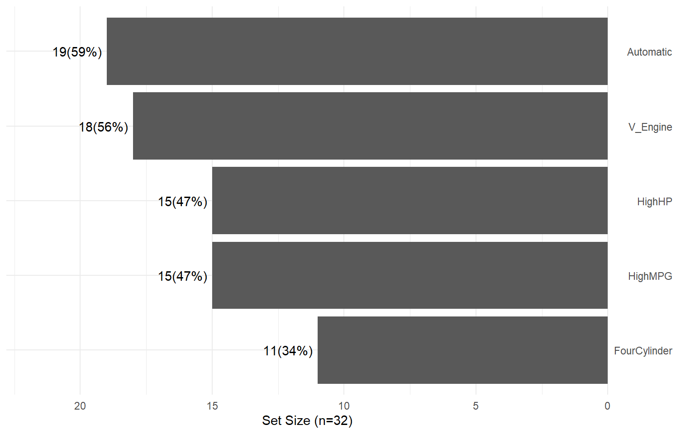
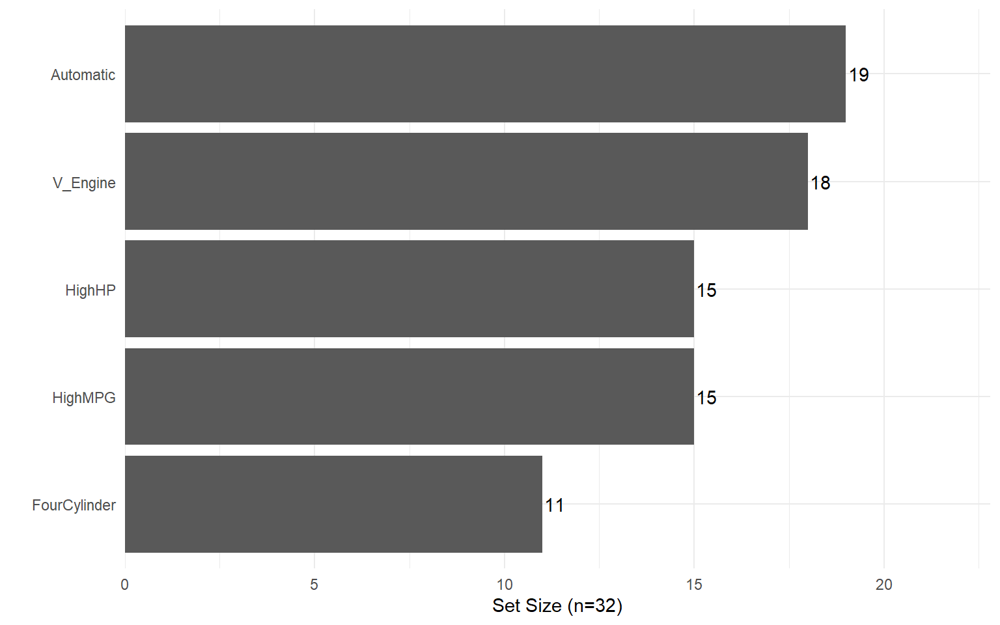
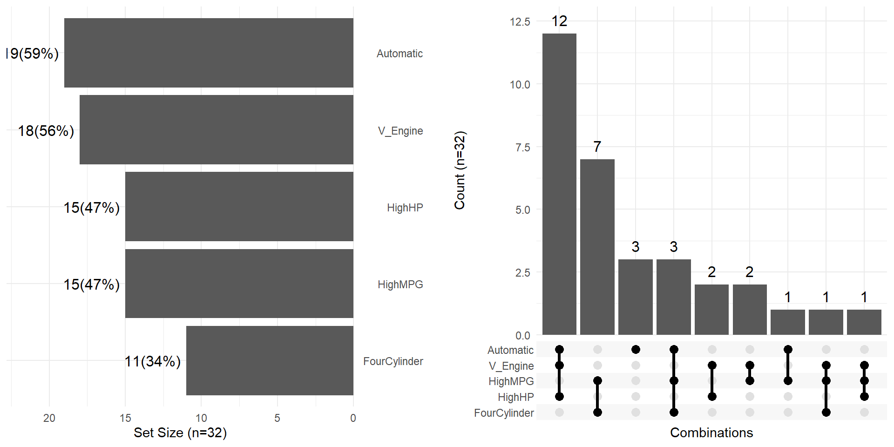
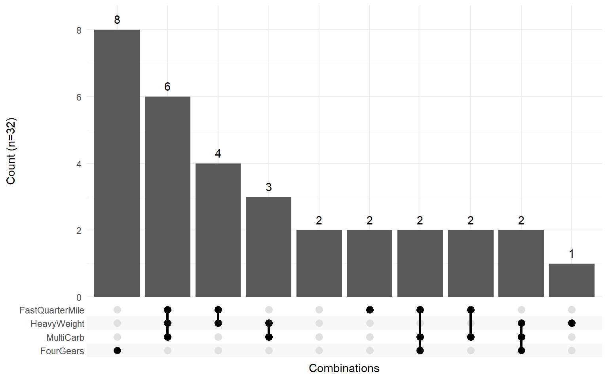
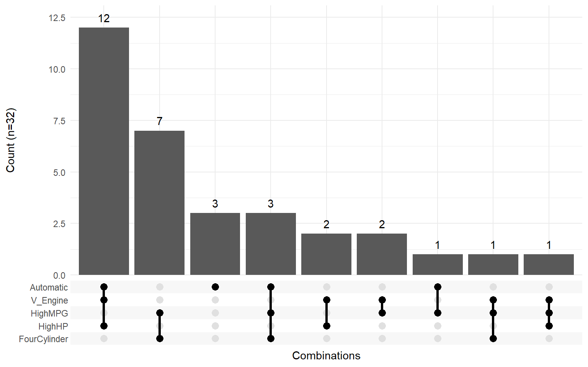
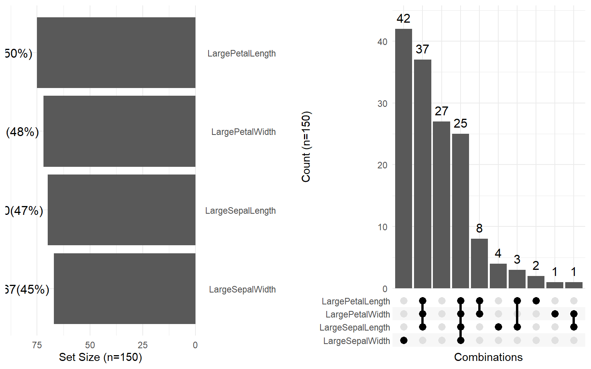

# Set Visualization with Upset Plots

**[GitHub Repository](https://github.com/afpybus/Pmisc)**

## Introduction

Upset plots provide a powerful alternative to Venn diagrams for
visualizing set intersections, especially when dealing with more than
3-4 sets. The Pmisc package provides two main functions:

- [`upset_plot()`](https://afpybus.github.io/Pmisc/reference/upset_plot.md):
  Creates the main intersection plot
- [`upset_side()`](https://afpybus.github.io/Pmisc/reference/upset_side.md):
  Creates side panels showing individual set sizes

These functions are built on top of the excellent **`ggupset`** package,
simplifying the creation of publication-ready figures.

This vignette demonstrates these functions using the `mtcars` dataset.

## Load Packages

``` r
library(Pmisc)
library(dplyr)
#> Warning: package 'dplyr' was built under R version 4.5.2
#> 
#> Attaching package: 'dplyr'
#> The following objects are masked from 'package:stats':
#> 
#>     filter, lag
#> The following objects are masked from 'package:base':
#> 
#>     intersect, setdiff, setequal, union
library(ggplot2)
#> Warning: package 'ggplot2' was built under R version 4.5.2
library(tibble)
#> Warning: package 'tibble' was built under R version 4.5.2
```

## Creating Binary Membership Data

First, let’s create binary (TRUE/FALSE) membership data from the
`mtcars` dataset based on various characteristics:

``` r
# Create binary indicators for different car characteristics
mtcars_binary <- mtcars %>%
    mutate(
        HighMPG = mpg > median(mpg),
        HighHP = hp > median(hp),
        FourCylinder = cyl == 4,
        Automatic = am == 0,
        V_Engine = vs == 0
    ) %>%
    select(HighMPG, HighHP, FourCylinder, Automatic, V_Engine)

# Preview the data
head(mtcars_binary) %>% knitr::kable()
```

|                   | HighMPG | HighHP | FourCylinder | Automatic | V_Engine |
|:------------------|:--------|:-------|:-------------|:----------|:---------|
| Mazda RX4         | TRUE    | FALSE  | FALSE        | FALSE     | TRUE     |
| Mazda RX4 Wag     | TRUE    | FALSE  | FALSE        | FALSE     | TRUE     |
| Datsun 710        | TRUE    | FALSE  | TRUE         | FALSE     | FALSE    |
| Hornet 4 Drive    | TRUE    | FALSE  | FALSE        | TRUE      | FALSE    |
| Hornet Sportabout | FALSE   | TRUE   | FALSE        | TRUE      | TRUE     |
| Valiant           | FALSE   | FALSE  | FALSE        | TRUE      | FALSE    |

Each row represents a car, and each column indicates membership in a set
(TRUE = member, FALSE = not a member).

## Basic Upset Plot

Create a basic upset plot showing all set intersections:

``` r
upset_plot(mtcars_binary)
#> Warning: There was 1 warning in `mutate()`.
#> ℹ In argument: `aggregate = list(c_across())`.
#> ℹ In row 1.
#> Caused by warning:
#> ! Using `c_across()` without supplying `cols` was deprecated in dplyr 1.1.0.
#> ℹ Please supply `cols` instead.
#> ℹ The deprecated feature was likely used in the Pmisc package.
#>   Please report the issue to the authors.
#> Warning: Using `size` aesthetic for lines was deprecated in ggplot2 3.4.0.
#> ℹ Please use `linewidth` instead.
#> ℹ The deprecated feature was likely used in the ggupset package.
#>   Please report the issue at <https://github.com/const-ae/ggupset/issues>.
#> This warning is displayed once per session.
#> Call `lifecycle::last_lifecycle_warnings()` to see where this warning was
#> generated.
```


**Reading the plot:**

- The x-axis shows different **combinations** of sets (connected dots
  below the bars)
- The y-axis shows the **count** of items in each intersection
- Connected dots indicate which sets are part of that intersection

## Customizing Text Size

For presentations or publications, you can adjust text size:

``` r
upset_plot(mtcars_binary, cex.text = 1.2)
```


## Side Panels: Set Sizes

The
[`upset_side()`](https://afpybus.github.io/Pmisc/reference/upset_side.md)
function creates bar charts showing the total size of each individual
set:

``` r
# Left side panel
upset_side(mtcars_binary, side = "left")
```



``` r
# Right side panel (without percentages)
upset_side(mtcars_binary, side = "right", add_percent = FALSE)
```



**Interpretation:**

- Each bar shows how many cars belong to that set
- The left panel shows counts on the left with percentages
- The right panel shows counts on the right

## Combining Upset Plot with Side Panel

For publication-quality figures, combine the upset plot with a side
panel:

``` r
# Create both plots
main_plot <- upset_plot(mtcars_binary, cex.text = 1.1)
side_plot <- upset_side(mtcars_binary, side = "left", cex.text = 1.1)

# Combine using make_grid
make_grid(list(side_plot, main_plot), nrow = 1, ncol = 2)
```



## Working with Different Set Sizes

Let’s create a more complex example with additional characteristics:

``` r
# Create more detailed binary classifications
mtcars_expanded <- mtcars %>%
    mutate(
        HeavyWeight = wt > median(wt),
        FastQuarterMile = qsec < median(qsec),
        FourGears = gear == 4,
        MultiCarb = carb > 2
    ) %>%
    select(HeavyWeight, FastQuarterMile, FourGears, MultiCarb)

# Create upset plot
upset_plot(mtcars_expanded)
```



## Using Custom Binary Values

The functions work with any binary indicator, not just TRUE/FALSE. You
can specify which value to treat as “TRUE”:

``` r
# Create data with 1/0 instead of TRUE/FALSE
mtcars_numeric <- mtcars_binary * 1 # Convert TRUE/FALSE to 1/0

# Use value = 1 to indicate membership
upset_plot(mtcars_numeric, value = 1)
```


``` r
# Works with any value
mtcars_text <- mtcars_binary %>%
    mutate(across(everything(), ~ ifelse(.x, "Yes", "No")))

upset_plot(mtcars_text, value = "Yes")
```



## Real-World Example: Plant Species Traits

Let’s use the `iris` dataset to show which species have above-median
measurements:

``` r
# Create binary indicators for above-median measurements
iris_binary <- iris %>%
    mutate(
        LargeSepalLength = Sepal.Length > median(Sepal.Length),
        LargeSepalWidth = Sepal.Width > median(Sepal.Width),
        LargePetalLength = Petal.Length > median(Petal.Length),
        LargePetalWidth = Petal.Width > median(Petal.Width)
    ) %>%
    select(LargeSepalLength, LargeSepalWidth, LargePetalLength, LargePetalWidth)

# Create combined visualization
iris_upset <- upset_plot(iris_binary, cex.text = 1.1)
iris_side <- upset_side(iris_binary, side = "left", cex.text = 1.1)

make_grid(list(iris_side, iris_upset), nrow = 1, ncol = 2)
```



## Interpreting Results

From the iris example above:

1.  The **side panel** shows individual set sizes (e.g., how many
    flowers have large petal length)
2.  The **upset plot** shows intersections (e.g., how many flowers have
    BOTH large petal length AND large petal width)
3.  **Single dots** represent flowers belonging to only one set
4.  **Connected dots** represent flowers belonging to multiple sets
    simultaneously

## Comparison to Venn Diagrams

Upset plots offer several advantages:

| Feature            | Venn Diagram     | Upset Plot     |
|--------------------|------------------|----------------|
| Max practical sets | 3-4              | 10+            |
| Exact counts       | Hard to read     | Clear bars     |
| All intersections  | May be cluttered | Always visible |
| Scalability        | Poor             | Excellent      |

## Customization Options

### Adjusting Side Panel Expansion

Control the white space in side panels:

``` r
upset_side(mtcars_binary, side = "right", expand = 0.3, add_percent = FALSE)
```


### Combining with Additional Styling

Since the output is a ggplot object, you can add additional styling:

``` r
upset_plot(mtcars_binary, cex.text = 1.1) +
    theme_minimal() +
    theme(
        plot.background = element_rect(fill = "white", color = NA),
        panel.grid.major = element_line(color = "gray90")
    )
```


## Summary

The Pmisc upset plot functions provide:

1.  **Clean visualization** of set intersections
2.  **Scalability** to many sets (unlike Venn diagrams)
3.  **Exact counts** for each intersection
4.  **Side panels** to show individual set sizes
5.  **Customization** options for text size and appearance
6.  **Flexibility** to work with any binary indicator variable

These tools are particularly useful for:

- Gene set analysis (which genes are in multiple pathways)
- Clinical data (which patients have combinations of conditions)
- Survey data (which respondents selected combinations of options)
- Quality control (which samples pass multiple criteria)

## Related Functions

- [`upset_plot()`](https://afpybus.github.io/Pmisc/reference/upset_plot.md):
  Main upset plot showing set intersections
- [`upset_side()`](https://afpybus.github.io/Pmisc/reference/upset_side.md):
  Side panel showing individual set sizes
- [`make_grid()`](https://afpybus.github.io/Pmisc/reference/make_grid.md):
  Combine multiple plots into a grid layout
